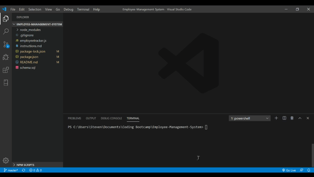

# Employee Management System - HW 12
https://github.com/stevenrsewell/Employee-Tracker.git

This application is a command line content management system for an employee database. It contains three tables named "Department," "Role," and "Employee." The application should allow the user to add, view and update values in the database.  It is run with the command:   `node employeetracker.js`

## User Story
AS A business owner ... I WANT to be able to view and manage the departments, roles, and employees in my company ... So THAT I can organize and plan my business

## Dependencies Used
<li>Node</li>
<li>Inquirer</li>
<li>MySQL</li>
<li>Javascript</li>

## Screenshot

